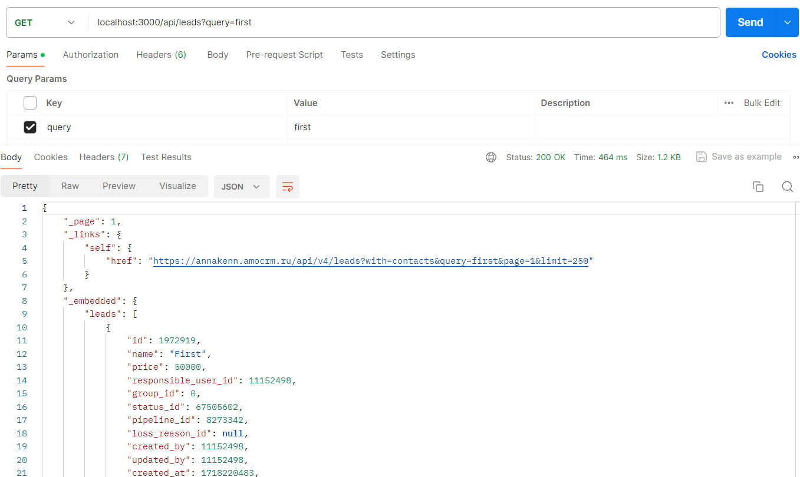
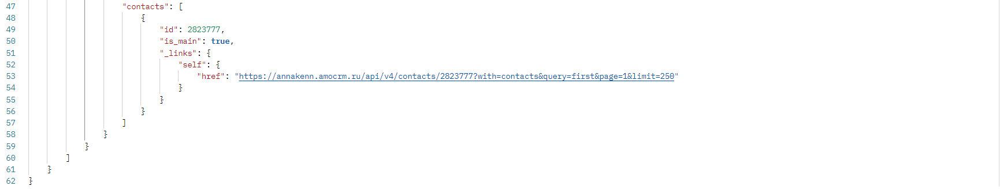

# Integration with amoCRM 

## Файл конфигурации
Конфигурация проекта должна быть описана в файле `.env`. Пример файла `.env.example`

##### Все эндпоинты имеют префикс `/api`
Пример ответа эндпоинта 

Также эндпоинт по-умолчанию отдаёт все сделки и прикреплённые к ним контакты, фильтрует сделки:

